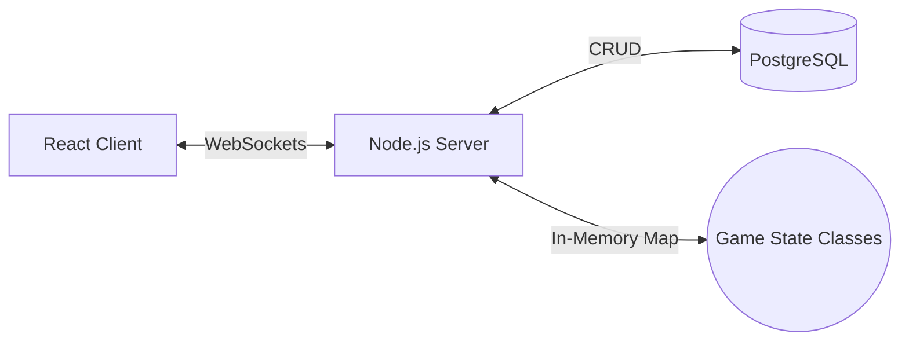

# Skribbl.io Clone - Real-Time Multiplayer Web Socket Arena

**A highly scalable, event-driven multiplayer drawing arena built for production.**  
*Developed as a Round 2 Technical Assignment Submission.*

[](https://reactjs.org/)
[](https://nodejs.org/)
[](https://socket.io/)
[](https://www.postgresql.org/)

---

## 🌐 Production Deployments

The application is fully deployed and optimized for both desktop and mobile viewports.

* **Primary Application Interface:** [https://skribbl.devvarshney.me/](https://skribbl.devvarshney.me/)
* **Backend Socket Provider (Render):** [https://skribbl-clone-yaf6.onrender.com](https://skribbl-clone-yaf6.onrender.com)
* **Code Repository:** [GitHub Repository](https://github.com/devvarshney45/skribbl-clone.git)

---

## 📖 Project Overview & Highlights

This project implements a complete end-to-end replicate of the popular multiplayer drawing game *Skribbl.io*. To surpass standard MVP requirements, this architecture prioritizes scalable backend design, asynchronous state bridging via WebSockets, and database persistence.

### Core Specifications Achieved:
* **Real-time multiplayer drawing & guessing:** Absolute low-latency path interpolation across client canvases.
* **Public & Private Routing:** Shareable invite links paired with random global lobby matchmaking.
* **OOP Architecture:** Clean class-based data structures isolating `Room`, `Game`, and `Player` states in-memory.
* **PostgreSQL (Neon) Database:** Engineered as recommended—persisting dictionary sets and match metadata.
* **Clean Version Control:** Systematically documented commit history outlining logical implementation steps.
* **Responsive UI/UX:** Mobile-ready "Glassmorphism" interface overlaying CSS grid constructs.

### Advanced Engineering Features (Bonus Extensions)
To demonstrate production-readiness, several advanced mechanisms were engineered into the match loop:
* **🤖 Smart AI Bots:** Algorithmic dummy players can be provisioned into lobbies for automated state-validation and match filling.
* **🥷 Hidden Word Mode:** Hardcore gametype removing metadata leaks (`_ _ _` length indicators) to prevent meta-gaming.
* **🎭 Emoji Avatars:** Deterministic UUID-hash entity mapping ensuring unique player avatars survive browser crashes.
* **⚖️ Votekick System:** Strict >50% consensus algorithm linked to deterministic socket expulsion and PostgreSQL connection bans.
* **👑 Auto Host Promotion:** Fallback authority algorithms ensure lobbies never hard-lock when hosts naturally sever connections.
* **🔌 10s Grace Period:** Transient network handlers holding state instances, allowing unexpected disconnecters to transparently reclaim their socket identity.
* **🧽 Destination-Out Eraser Tool:** Native canvas compositing that carves strokes completely rather than utilizing lazy color-fill layers.

---

## 🏗️ System Architecture

The ecosystem separates real-time ephemeral game state from persistent data storage, operating primarily via a robust Event-Driven Architecture.



### Component Breakdown
| Layer | Technologies | Primary Purpose |
| :--- | :--- | :--- |
| **Frontend UI** | React 18, TypeScript, Tailwind | Canvas event listening, buffer arrays, scalable UI tokens. |
| **Backend API** | Node.js, Express.js | Route handling, HTTP lifecycle provisioning, REST facades. |
| **Transport** | Socket.IO | Full-duplex bidirectional arrays linking client Cartesian maps to server logic. |
| **Persistence** | PostgreSQL (`pg`), Neon | Transactional ledgering, avoiding long-term memory leaks. |

---

## 🛠️ Local Development & Orchestration

The repository leverages a unified workspace script block allowing simultaneous front/backend booting.

### Prerequisites
* **Node.js**: v18.x or higher
* **npm**: v9+
* **PostgreSQL**: Accessible local/remote URL string

### Command Line Instruction set:

```bash
# 1. Clone implementation
git clone https://github.com/devvarshney45/skribbl-clone.git
cd skribbl-clone

# 2. Workspace installation
npm run install-all

# 3. Provision environment variables inside `server/.env`
# PORT=3001
# CLIENT_URL=http://localhost:5173
# DATABASE_URL=postgresql://link...

# 4. Boot internal environments
npm run dev
# (Client serves on 5173, Server multiplexes on 3001)
```

---
*Developed by Dev Varshney (6397003690) | Code Assessment Submission*
